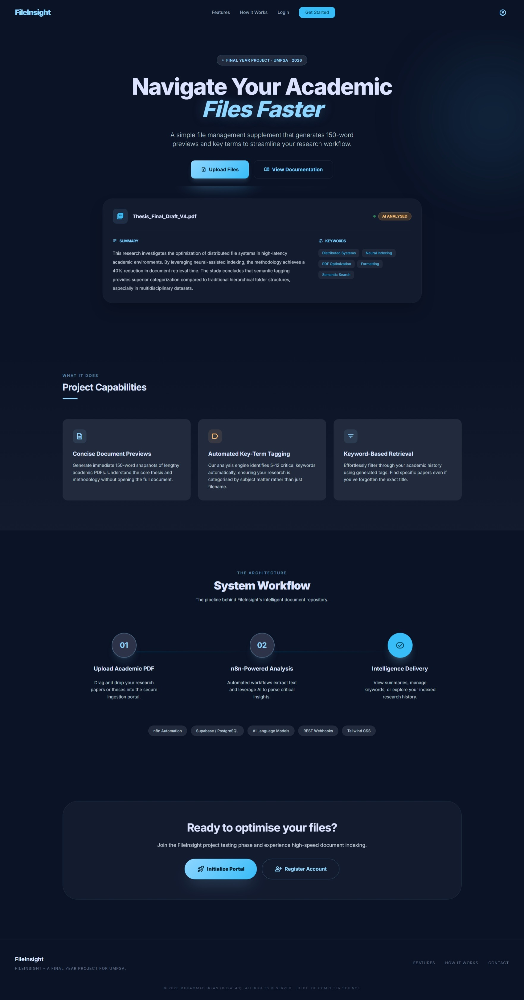
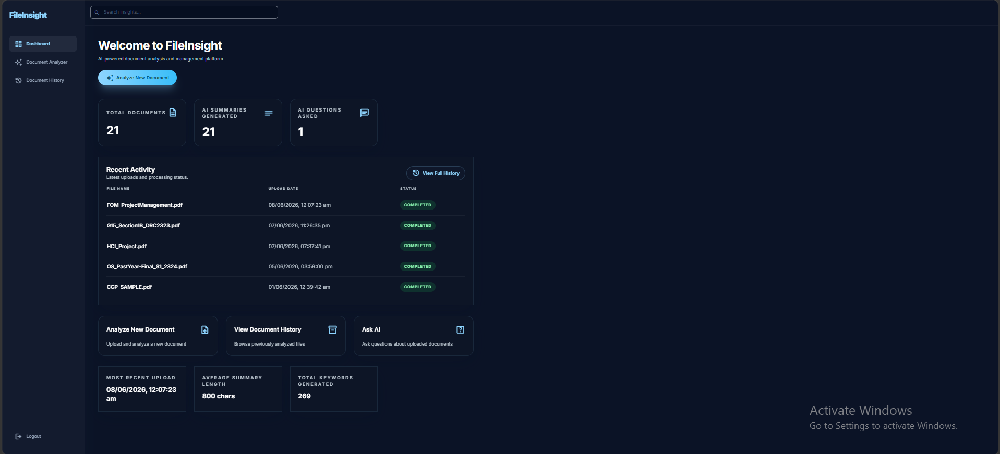
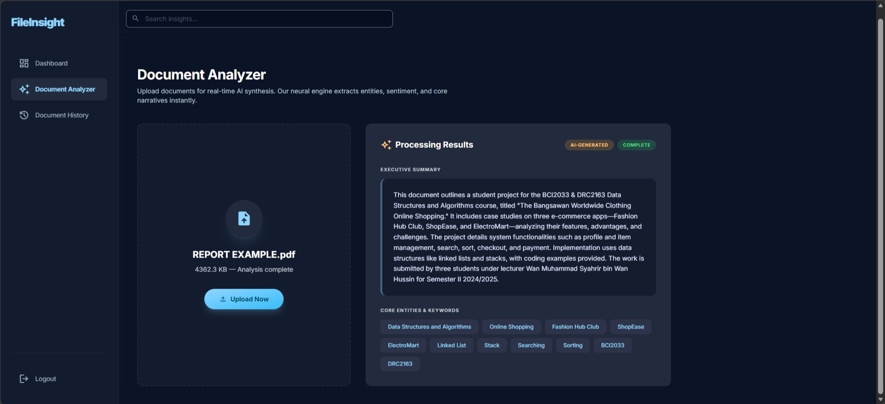
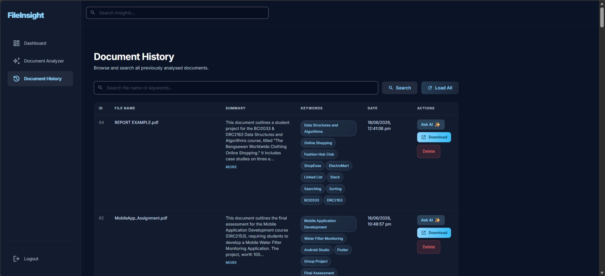
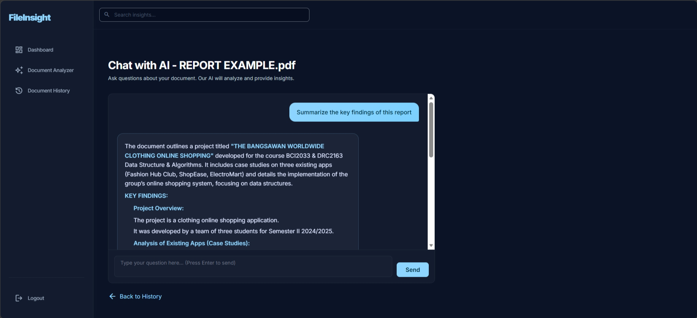

# FileInsight — AI-Powered Academic Document Intelligence Platform

**Live:** [file-insight-six.vercel.app](https://file-insight-six.vercel.app/)

FileInsight is a document management platform that transforms how students interact with their academic files. Instead of opening and manually reading every PDF to recall its content, users get an instant AI-generated summary, extracted keywords, and a built-in chatbot to ask questions directly about any uploaded document.

The project was built as a Final Year Project to explore how workflow automation and LLM integration can remove the repetitive friction of manual document review, applying the same orchestration-first thinking used in production automation systems.

## Problem

Managing academic files across lecture notes, assignments, and reference material becomes inefficient at scale:

1. Files pile up across local storage and cloud drives with no context
2. Understanding what's inside a file requires opening it manually
3. Revisiting old material means re-reading instead of recalling
4. Existing AI summarizer tools don't retain files — every session starts from zero

FileInsight was designed to remove this friction by pairing file storage with automatic content intelligence in a single workflow.

## What It Does

1. **Upload** — User drags a PDF into the analyzer; the file is sent to a backend automation pipeline
2. **Process** — Text is extracted, sanitized, and routed to an LLM for summarization and keyword extraction
3. **Store** — Results are persisted in a cloud database alongside the file's metadata and storage URL
4. **Retrieve** — Users browse a searchable history table filterable by filename or keyword
5. **Converse** — An "Ask AI" chatbot lets users query the content of any specific document using natural language

## Tech Stack

**Frontend:** HTML5, Vanilla JavaScript, Tailwind CSS
**Backend automation:** n8n (workflow orchestration)
**AI processing:** LLM integration via OpenRouter API
**Database & storage:** Supabase (PostgreSQL + file storage)
**Hosting:** Vercel

## System Architecture

FileInsight is built as a workflow-driven system using n8n as the orchestration layer connecting the frontend to AI processing and the database.

Pipeline:
Document Upload
→ Text Extraction & Sanitization
→ LLM Summarization + Keyword Extraction
→ Database Persistence
→ Search & Retrieval / Contextual Chatbot

## Architecture Highlights

- **Five dedicated n8n workflows** handle document processing, history retrieval with dynamic search filtering, contextual chatbot Q&A, authentication, and deletion — each isolated as its own webhook-triggered pipeline
- **Defensive output parsing** — a custom regex layer normalizes inconsistent LLM output formatting (markdown artifacts, stringified JSON arrays) before persistence, preventing malformed data from breaking the frontend render
- **Context-aware chatbot** — each chat session is scoped to a specific document by retrieving its stored raw text from the database and injecting it directly into the LLM prompt, ensuring answers are grounded in the source file rather than general knowledge
- **Session-based authentication** — login and registration handled through a dedicated n8n workflow issuing session tokens validated on every protected route transition

## Screenshots

### Landing Page

### Dashboard

### Document Analyzer

### Document History 

### AI Chatbot

## Repository Scope
This repository contains the frontend application only. The n8n workflow definitions, AI prompt configuration, and Supabase schema are part of the supporting infrastructure and are not included.

